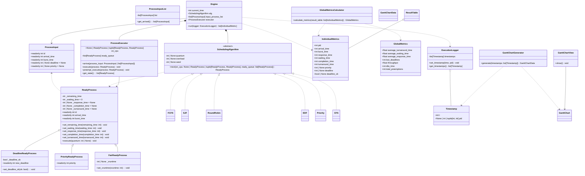

# Diagrama UML - Escalonador

```mermaid
classDiagram

    class ProcessInput {
        +readonly int id
        +readonly int arrival_time
        +readonly int burst_time
        +readonly int | None deadline = None
        +readonly int | None priority = None
    }
    
    class ProcessInputList {
	    -list[ProcessInput] list
			+get_arrived(): list[ProcessInput]
    }
   
    class ReadyProcess {
      -int _remaining_time
  		-int _waiting_time = 0
  		-int | None _response_time = None
      -int | None _completion_time = None
      -int | None _turnaround_time = None
  		+readonly int id
  		+readonly int arrival_time
      +readonly int burst_time
        
      +set_remaining_time(remaining_time: int) void
      +set_waiting_time(waiting_time: int) void
      +set_response_time(response_time: int) void
      +set_completion_time(completion_time: int) void
      +set_turnaround_time(turnaround_time: int) void
      +execute(quantum: int | None) void
    }
    
    class DeadlineReadyProcess {
  		-bool _deadline_ok
	    +readonly int new_deadline

	    +set_deadline_ok(ok: bool): void
    }
    
    class PriorityReadyProcess {
	    +readonly int priority
    }
    
    class FairReadyProcess {
	    -int | None _vruntime
	    
	    +set_vruntime(vruntime: int): void
    }
    
    class SchedulingAlgorithm {
        <<abstract>>
        -int | None quantum
        -int | None overload
        -int | None seed
        +next(on_cpu: None | ReadyProcess | tuple[ReadyProcess, ReadyProcess], ready_queue: list[ReadyProcess]) ReadyProcess
    }

    class FCFS
    class SJF
    class RoundRobin
    class EDF
    class Priority
    class CFS
    
    class ProcessExecutor {
        +None | ReadyProcess | tuple[ReadyProcess, ReadyProcess] on_cpu
        +list[ReadyProcess] ready_queue
        +arrive(process_input: ProcessInput | list[ProcessInput])
        +execute(process: ReadyProcess) void
        +preempt_execute(process: ReadyProcess) void
        +get_state(): list[ReadyProcess]
    }

    class Engine {
        +int current_time
        +SchedulingAlgorithm alg
        +list[ProcessInput] input_process_list
        +ProcessExecutor executor
        +run(logger: ExecutionLogger) list[IndividualMetric]
    }


    class IndividualMetrics {
        +int pid
        +int arrival_time
        +int burst_time
        +int response_time
        +int waiting_time
        +int completion_time
        +int turnaround_time
        +int | None priority
        +int | None deadline
        +bool | None deadline_ok
    }

    class GlobalMetrics {
        +float average_turnaround_time
        +float average_waiting_time
        +float average_response_time
        +int lost_deadlines
        +float throughput
        +int idle_time
        +int total_preemptions
    }
    
    class GlobalMetricsCalculator {
        +calculate_metrics(result_table: list[IndividualMetrics]) GlobalMetrics
    }

    class Timestamp {
        +int t
        +None | int | tuple[int, int] pid
    }

    class ExecutionLogger {
        -list[Timestamp] timestamps
        +set_timestamp(time, pid) void
        +get_timestamps() list[Timestamp]
    }

    class GanttChartData {
    }

    class GanttChartGenerator {
        +generate(timestamps: list[Timestamp]) GanttChartData
    }

    class GanttChartView {
        +show() void
    }


    ProcessInput <.. ReadyProcess
    
    ReadyProcess <|-- DeadlineReadyProcess   
    ReadyProcess <|-- PriorityReadyProcess
    ReadyProcess <|-- FairReadyProcess
    
    SchedulingAlgorithm ..> ReadyProcess
    SchedulingAlgorithm <|.. FCFS
    SchedulingAlgorithm <|.. SJF
    SchedulingAlgorithm <|.. RoundRobin
    SchedulingAlgorithm <|.. EDF
    SchedulingAlgorithm <|.. Priority
    SchedulingAlgorithm <|.. CFS

    Engine *-- ProcessExecutor
    Engine *-- SchedulingAlgorithm
    Engine --> ProcessInput
    
    ProcessExecutor --> ReadyProcess
    ExecutionLogger o-- Timestamp

    Engine ..> ExecutionLogger
    Engine ..> IndividualMetrics
    GlobalMetricsCalculator ..> IndividualMetrics
    GlobalMetricsCalculator ..> GlobalMetrics
    GanttChartGenerator ..> Timestamp
    GanttChartGenerator ..> GanttChart
    GanttChartView --> GanttChart
    
    ResultTable o-- IndividualMetrics
```

chat diagramas
https://claude.ai/chat/e8f108d9-5213-40cf-9465-77a078b0474b
