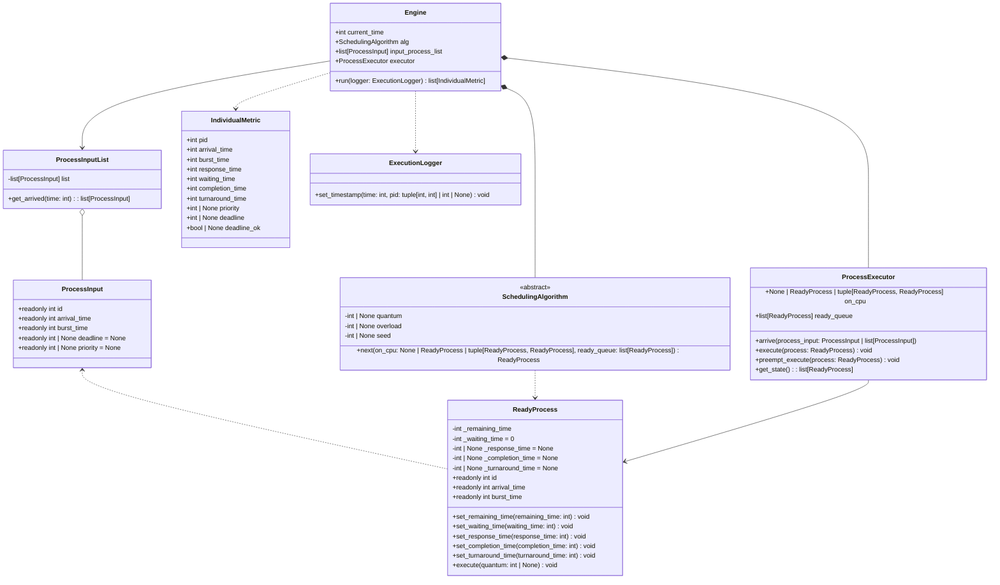

# Diagrama UML - Engine

```mermaid
classDiagram
    class ProcessInput {
        +readonly int id
        +readonly int arrival_time
        +readonly int burst_time
        +readonly int | None deadline = None
        +readonly int | None priority = None
    }
    
    class ProcessInputList {
	    -list[ProcessInput] list
			+get_arrived(time: int): list[ProcessInput]
    }
   
    class ReadyProcess {
      -int _remaining_time
  		-int _waiting_time = 0
  		-int | None _response_time = None
      -int | None _completion_time = None
      -int | None _turnaround_time = None
  		+readonly int id
  		+readonly int arrival_time
      +readonly int burst_time
        
      +set_remaining_time(remaining_time: int) void
      +set_waiting_time(waiting_time: int) void
      +set_response_time(response_time: int) void
      +set_completion_time(completion_time: int) void
      +set_turnaround_time(turnaround_time: int) void
      +execute(quantum: int | None) void
    }
    
    class SchedulingAlgorithm {
        <<abstract>>
        -int | None quantum
        -int | None overload
        -int | None seed
        +next(on_cpu: None | ReadyProcess | tuple[ReadyProcess, ReadyProcess], ready_queue: list[ReadyProcess]) ReadyProcess
    }
    
    class ProcessExecutor {
        +None | ReadyProcess | tuple[ReadyProcess, ReadyProcess] on_cpu
        +list[ReadyProcess] ready_queue
        +arrive(process_input: ProcessInput | list[ProcessInput])
        +execute(process: ReadyProcess) void
        +preempt_execute(process: ReadyProcess) void
        +get_state(): list[ReadyProcess]
    }

    class Engine {
        +int current_time
        +SchedulingAlgorithm alg
        +list[ProcessInput] input_process_list
        +ProcessExecutor executor
        +run(logger: ExecutionLogger) list[IndividualMetric]
    }

    class IndividualMetric {
        +int pid
        +int arrival_time
        +int burst_time
        +int response_time
        +int waiting_time
        +int completion_time
        +int turnaround_time
        +int | None priority
        +int | None deadline
        +bool | None deadline_ok
    }

    class ExecutionLogger {
        +set_timestamp(time: int, pid: tuple[int, int] | int | None) void
    }

    ProcessInputList o-- ProcessInput
    ProcessInput <.. ReadyProcess
    
    SchedulingAlgorithm ..> ReadyProcess

    Engine *-- ProcessExecutor
    Engine *-- SchedulingAlgorithm
    Engine --> ProcessInputList
    
    ProcessExecutor --> ReadyProcess

    Engine ..> ExecutionLogger
    Engine ..> IndividualMetric
```
