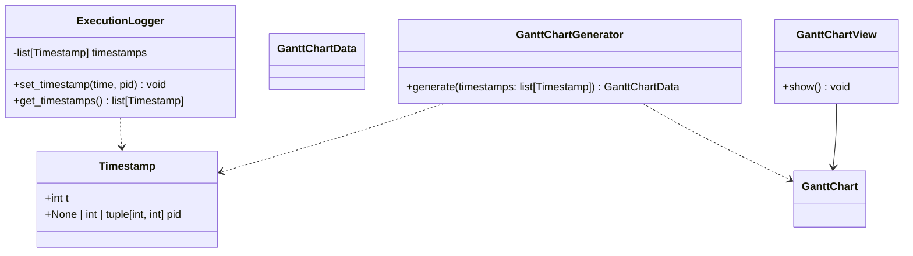

# Diagrama UML - Gantt

```mermaid
classDiagram
    class Timestamp {
        +int t
        +None | int | tuple[int, int] pid
    }

    class ExecutionLogger {
        -list[Timestamp] timestamps
        +set_timestamp(time, pid) void
        +get_timestamps() list[Timestamp]
    }

    class GanttChartData {
    }

    class GanttChartGenerator {
        +generate(timestamps: list[Timestamp]) GanttChartData
    }

    class GanttChartView {
        +show() void
    }
    
    ExecutionLogger ..> Timestamp
    GanttChartGenerator ..> Timestamp
    GanttChartGenerator ..> GanttChart
    GanttChartView --> GanttChart
```
