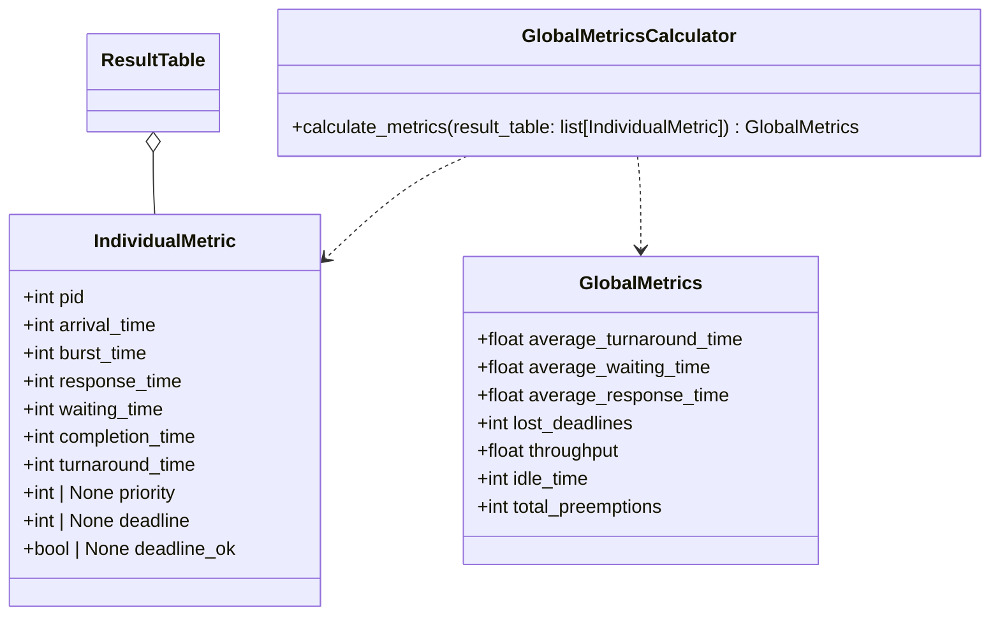

# Diagrama UML - Metrics

```mermaid
classDiagram
    class IndividualMetric {
        +int pid
        +int arrival_time
        +int burst_time
        +int response_time
        +int waiting_time
        +int completion_time
        +int turnaround_time
        +int | None priority
        +int | None deadline
        +bool | None deadline_ok
    }

    class GlobalMetrics {
        +float average_turnaround_time
        +float average_waiting_time
        +float average_response_time
        +int lost_deadlines
        +float throughput
        +int idle_time
        +int total_preemptions
    }
    
    class GlobalMetricsCalculator {
        +calculate_metrics(result_table: list[IndividualMetric]) GlobalMetrics
    }

    GlobalMetricsCalculator ..> IndividualMetric
    GlobalMetricsCalculator ..> GlobalMetrics
    
    ResultTable o-- IndividualMetric
```
