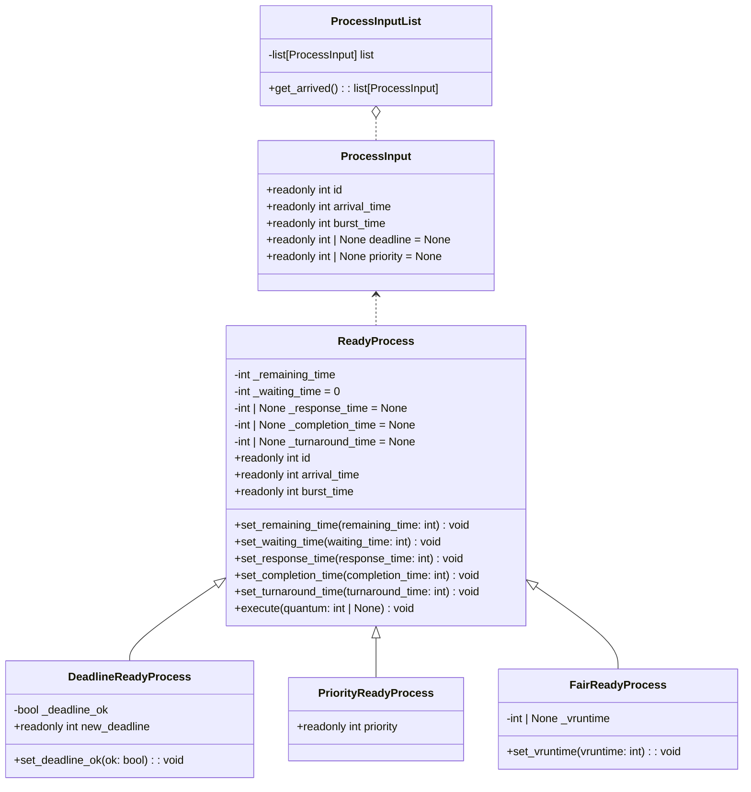

# Diagrama UML - Process

```mermaid
classDiagram

    class ProcessInput {
        +readonly int id
        +readonly int arrival_time
        +readonly int burst_time
        +readonly int | None deadline = None
        +readonly int | None priority = None
    }
    
    class ProcessInputList {
	    -list[ProcessInput] list
			+get_arrived(): list[ProcessInput]
    }
   
    class ReadyProcess {
      -int _remaining_time
  		-int _waiting_time = 0
  		-int | None _response_time = None
      -int | None _completion_time = None
      -int | None _turnaround_time = None
  		+readonly int id
  		+readonly int arrival_time
      +readonly int burst_time
        
      +set_remaining_time(remaining_time: int) void
      +set_waiting_time(waiting_time: int) void
      +set_response_time(response_time: int) void
      +set_completion_time(completion_time: int) void
      +set_turnaround_time(turnaround_time: int) void
      +execute(quantum: int | None) void
    }
    
    class DeadlineReadyProcess {
  		-bool _deadline_ok
	    +readonly int new_deadline

	    +set_deadline_ok(ok: bool): void
    }
    
    class PriorityReadyProcess {
	    +readonly int priority
    }
    
    class FairReadyProcess {
	    -int | None _vruntime
	    
	    +set_vruntime(vruntime: int): void
    }
    
    ProcessInput <.. ReadyProcess
    ProcessInputList o.. ProcessInput
    
    ReadyProcess <|-- DeadlineReadyProcess   
    ReadyProcess <|-- PriorityReadyProcess
    ReadyProcess <|-- FairReadyProcess
```
